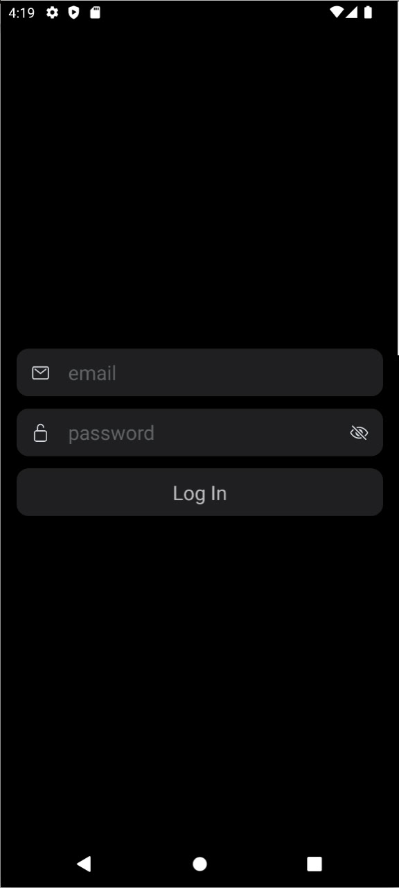
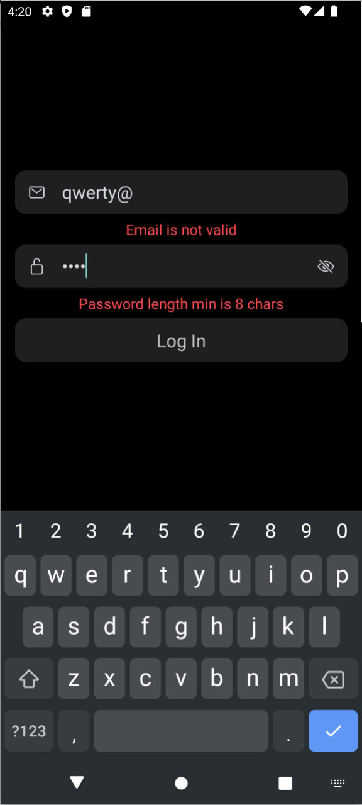
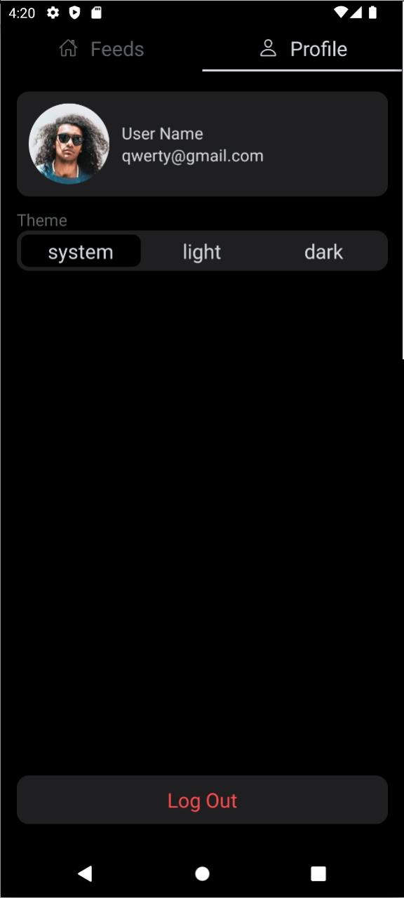
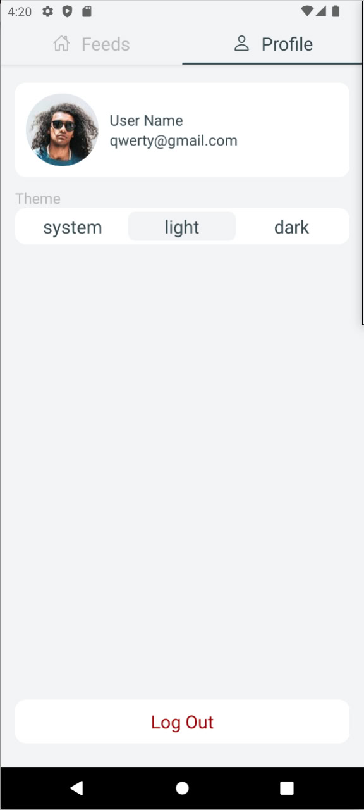

# Test App

clone code, open the folder, install dependencies, start the server

```
git git@github.com:Oscare101/LogInCardTestApp.git
cd LogInCardTestApp/
npm i
npx react-native start
```

screenshots:






